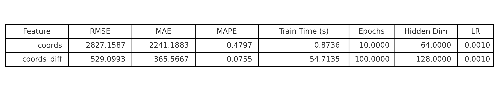
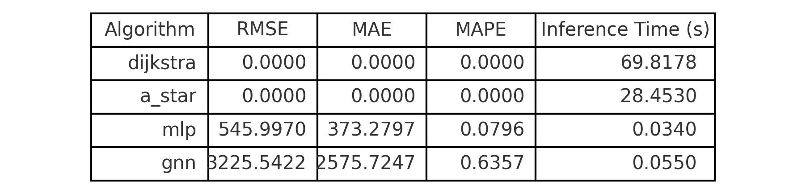
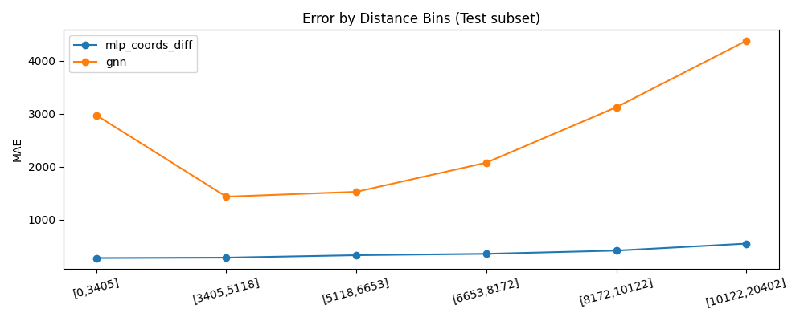
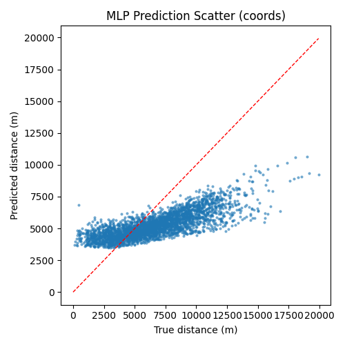
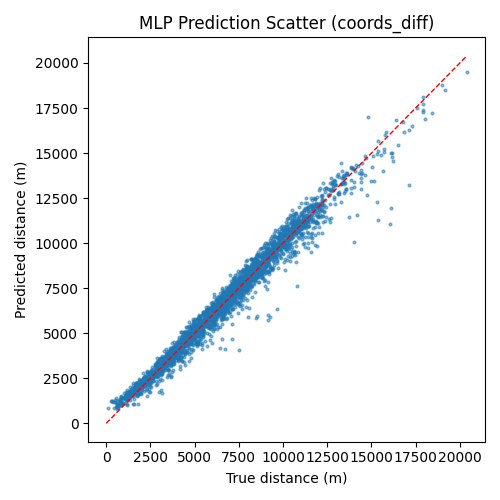
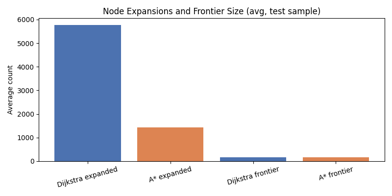

# CPS3440 Project

A course project for CPS3440 exploring neural-network–based regression with a focus on model accuracy, error distribution, and inference efficiency.

## 1. Overview

This repository contains code and data for training and evaluating a multilayer perceptron (MLP) model on a spatial prediction task.

The project includes:

- Data preprocessing and feature engineering  
- MLP model training and hyperparameter tuning  
- Quantitative evaluation with standard regression metrics  
- Visual analysis of prediction errors and spatial patterns  
- Comparison of inference times and model expansion behaviour  

## 2. Repository Structure

```text
CPS3440-project/
├── artifacts/          # Saved figures and result plots
├── data/
│   └── sf/             # Input data files
├── scripts/            # CLI scripts for training / evaluation
├── src/                # Core source code (models, utils, etc.)
├── README.md
└── requirements.txt    # Python dependencies
```

## 3. Installation

1. **Clone the repository**

   ```bash
   git clone https://github.com/<your-username>/CPS3440-project.git
   cd CPS3440-project
   ```

2. **Create and activate a virtual environment (optional but recommended)**

   ```bash
   python -m venv .venv
   source .venv/bin/activate   # On Windows: .venv\Scripts\activate
   ```

3. **Install dependencies**

   ```bash
   pip install -r requirements.txt
   ```

## 4. Usage

### 4.1 Data Preparation

Place the required raw data files under `data/sf/`.  
If additional preprocessing is needed, use the corresponding script in `scripts/` (for example, to clean data, normalize features, or split train/test sets).

### 4.2 Training

Run the training script to fit the MLP model and save evaluation artifacts:

```bash
python scripts/train_mlp.py \
    --data_dir data/sf \
    --output_dir artifacts
```

This will:

- Train the MLP model  
- Evaluate it on the test set  
- Save plots and metrics under `artifacts/`

### 4.3 Evaluation and Inference

To run evaluation or perform inference only (using a pre-trained model):

```bash
python scripts/evaluate_mlp.py \
    --data_dir data/sf \
    --output_dir artifacts \
    --model_path artifacts/best_mlp.pt
```

## 5. Results

### 5.1 Feature Comparison: `coords` vs `coords_diff`

This table compares two feature sets for the MLP: using raw coordinates (`coords`) versus coordinate differences (`coords_diff`).  
`coords_diff` dramatically reduces the error (RMSE from ~2827 to ~529 and MAPE from ~0.48 to ~0.08), at the cost of a much longer training time and a larger model (more epochs and a bigger hidden dimension). This suggests that difference-based features capture more informative structure for the regression task, even though they are more expensive to train.



### 5.2 Algorithm Comparison: Shortest Path vs Learned Models

This table compares classic shortest-path algorithms (Dijkstra and A*) with learned models (MLP and GNN).  
Dijkstra and A* achieve zero error by construction but have very long inference times (around 70 s and 28 s). The MLP has small but non-zero errors (RMSE ≈ 546, MAPE ≈ 0.08) while its inference time is orders of magnitude faster (~0.03 s), making it a practical approximation when many queries are needed. The GNN in this setup is slower and less accurate than the MLP, indicating that its current architecture or training regime is not yet competitive.



### 5.3 Overall MLP Metrics

Overall regression performance of the MLP model (e.g., RMSE, MAE, R²).


### 5.4 Error Bins

Binned distribution of prediction errors.



### 5.5 MLP Error Coordinates

Absolute prediction error over spatial coordinates.


### 5.6 MLP Error Coordinates (Difference)

Difference in error over spatial coordinates.


### 5.7 MLP Scatter Coordinates

Scatter plot of predictions vs. ground truth over coordinates.



### 5.8 MLP Scatter Coordinates (Difference)

Difference in scatter patterns.



### 5.9 Expansion Bars

Expansion behaviour visualised as bar plots.



### 5.10 Inference Times

Comparison of inference times for different settings.


## 6. Project Notes

- All figures in the `artifacts/` directory are generated automatically by the training and evaluation scripts.  
- Random seeds may be used for reproducibility; see the relevant script arguments in `scripts/`.  
- Hyperparameters (such as learning rate, layer sizes, batch size, and number of epochs) can be configured via command-line flags or configuration files.

## 7. Members
   Lu Mengqing 1308178
   Liu Pengyu 1235786
   

