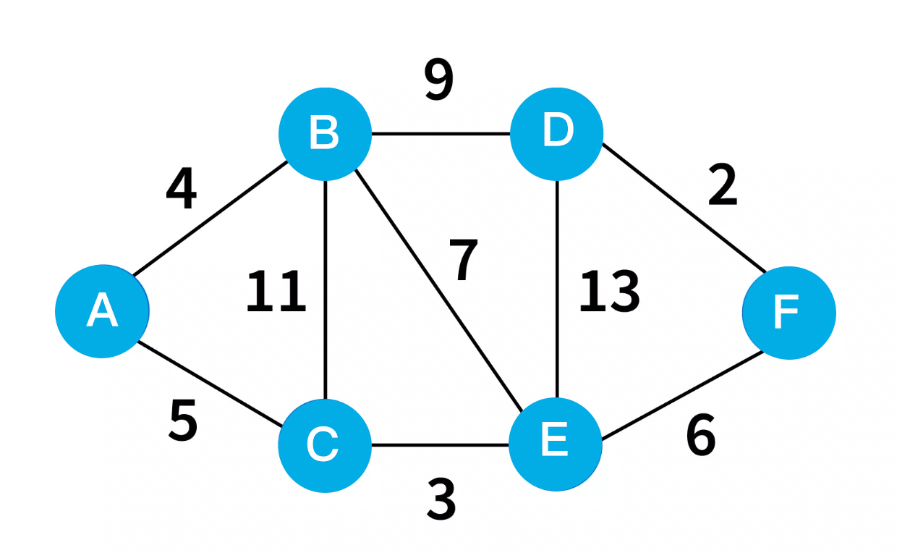
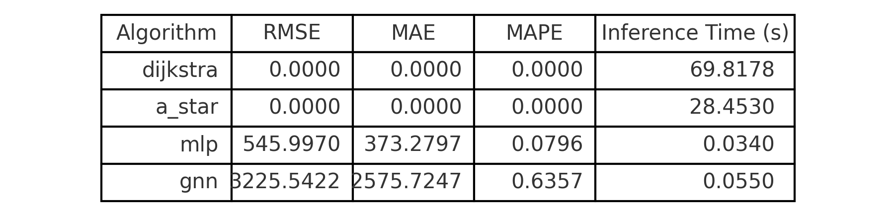
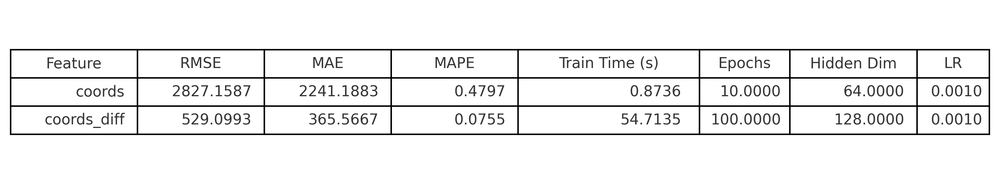
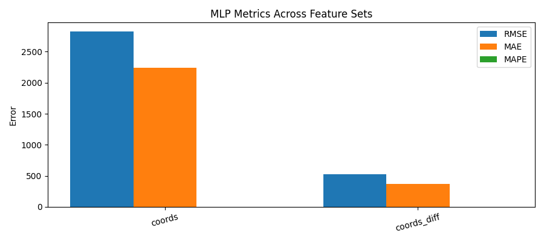
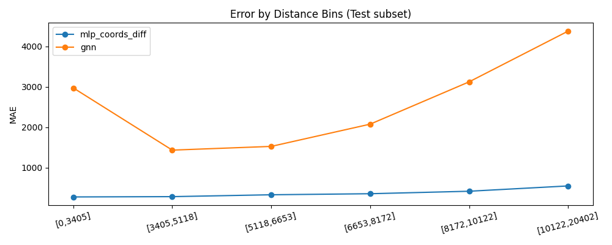
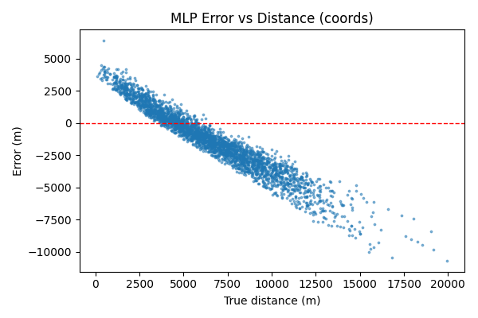
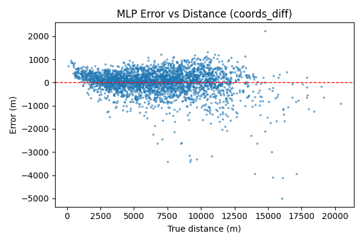
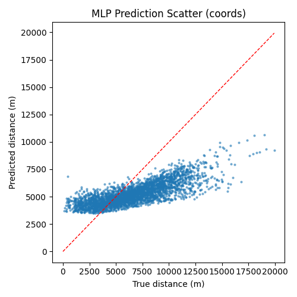
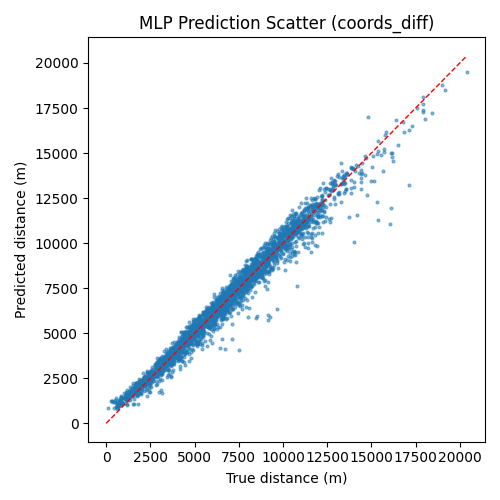
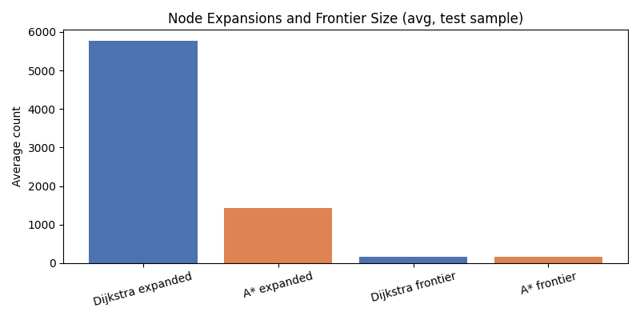

# CPS3440 Project

A course project for CPS3440 exploring neural-network–based regression with a focus on model accuracy, error distribution, and inference efficiency.

## 1. Overview

This repository contains code and data for training and evaluating a multilayer perceptron (MLP) model on a spatial prediction task.

The project includes:

- Data preprocessing and feature engineering  
- MLP model training and hyperparameter tuning  
- Quantitative evaluation with standard regression metrics  
- Visual analysis of prediction errors and spatial patterns  
- Comparison of inference times and model expansion behaviour  

### Visual Motivation: Road Network and Shortest-Path Intuition

The core setting of this project is closely related to routing on a city road network.  
We use San Francisco as a spatial example, where intersections can be treated as nodes and roads as edges.


Classic shortest-path algorithms (such as Dijkstra and A*) search over a weighted graph to find the optimal route.  
The figure below is a simple illustration of shortest-path reasoning on a graph.



A more intuitive view is grid-style pathfinding, where the goal is to move from start to destination with minimal cost.  
This helps explain why learned models can be useful as fast approximators when exact search becomes expensive.


## 2. Repository Structure

```text
CPS3440-project/
├── artifacts/          # Saved figures and result plots
├── data/
│   └── sf/             # Input data files
├── scripts/            # CLI scripts for training / evaluation
├── src/                # Core source code (models, utils, etc.)
├── README.md
└── requirements.txt    # Python dependencies
```

## 3. Installation

1. **Clone the repository**

   ```bash
   git clone https://github.com/<your-username>/CPS3440-project.git
   cd CPS3440-project
   ```

2. **Create and activate a virtual environment (optional but recommended)**

   ```bash
   python -m venv .venv
   source .venv/bin/activate   # On Windows: .venv\Scripts\activate
   ```

3. **Install dependencies**

   ```bash
   pip install -r requirements.txt
   ```

## 4. Usage

### 4.1 Data Preparation

Place the required raw data files under `data/sf/`.  
If additional preprocessing is needed, use the corresponding script in `scripts/` (for example, to clean data, normalize features, or split train/test sets).

### 4.2 Training

Run the training script to fit the MLP model and save evaluation artifacts:

```bash
python scripts/train_mlp.py \
    --data_dir data/sf \
    --output_dir artifacts
```

This will:

- Train the MLP model  
- Evaluate it on the test set  
- Save plots and metrics under `artifacts/`

### 4.3 Evaluation and Inference

To run evaluation or perform inference only (using a pre-trained model):

```bash
python scripts/evaluate_mlp.py \
    --data_dir data/sf \
    --output_dir artifacts \
    --model_path artifacts/best_mlp.pt
```

## 5. Results

### 5.1 Algorithm Comparison: Shortest Path vs Learned Models

This table compares classic shortest-path algorithms (Dijkstra and A*) with the learned models (MLP and GNN).  
After hyperparameter tuning, the MLP achieves RMSE ≈ 546 and MAPE ≈ 0.08. This error level is small enough for the target application, while the inference time is around 0.03 s, which is several orders of magnitude faster than Dijkstra (~70 s) and A* (~28 s).  
The GNN, in contrast, still has much larger errors (RMSE > 3200, MAPE > 0.63) and slightly slower inference than the MLP, so it is kept only as an experimental baseline and is not used in the final system.



### 5.2 MLP Feature Ablation Results: `coords` vs `coords_diff`

This table compares two feature sets for the MLP: using raw coordinates (`coords`) versus coordinate differences (`coords_diff`).  
`coords_diff` dramatically reduces the error (RMSE from ~2827 to ~529 and MAPE from ~0.48 to ~0.08), at the cost of a much longer training time and a larger model (more epochs and a bigger hidden dimension). This suggests that difference-based features capture more informative structure for the regression task, even though they are more expensive to train.



### 5.3 Overall MLP Metrics

This figure summarises the main regression metrics of the final MLP configuration, including RMSE, MAE, MAPE and possibly additional indicators such as R².  
Together, these metrics show that the model is consistently accurate across different error measures: RMSE and MAE remain at a moderate level, while MAPE indicates that the relative error is small compared to the typical target value.  
This global view supports the conclusion that the tuned MLP is stable and accurate enough to be used as the main predictive component in the system.



### 5.4 Error Bins

This histogram groups prediction errors into bins and shows how many samples fall into each error range.  
Most samples concentrate in the low-error bins around zero, which means that for the majority of cases the model prediction is close to the ground truth.  
Only a small portion of samples fall into the large-error bins; these outliers correspond to difficult cases where the current features or model capacity are not sufficient.  
Such a view is useful for diagnosing whether the model is generally unreliable or mainly struggles with a few rare patterns.



### 5.5 MLP Error Coordinates

This plot visualises the absolute prediction error over spatial coordinates. Each point corresponds to a location, coloured or sized according to the magnitude of its error.  
By inspecting this figure we can see whether errors are uniformly distributed or concentrated in specific regions of the space (for example, at the boundary of the map or in very dense areas).  
Regions with systematically higher errors can indicate missing features (e.g., local traffic patterns) or distribution shift, and they provide a clear target for future data collection or model refinement.



### 5.6 MLP Error Coordinates (Difference)

Here we plot the difference in error between two configurations (e.g., `coords` vs `coords_diff`) over the same coordinate space.  
Locations where the value is negative represent points where the new configuration reduces error, while positive values indicate places where it becomes slightly worse.  
This comparison helps to understand *where* the feature change brings improvement: instead of only seeing average metrics, we can identify regions of the map that benefit the most from the new features and regions where the effect is neutral.



### 5.7 MLP Scatter Coordinates

This scatter plot compares predicted values with ground-truth values over coordinates. Points close to the diagonal line correspond to accurate predictions, while points far from the diagonal indicate larger errors.  
The overall shape of the cloud shows how well the model captures the relationship between input features and targets; a tight cluster around the diagonal means that the model rarely over- or under-estimates by a large margin.  
This figure complements the numerical metrics by providing an intuitive visual check of model calibration.



### 5.8 MLP Scatter Coordinates (Difference)

This plot focuses on the change in scatter patterns between two model or feature configurations.  
By highlighting where points move closer to or further from the diagonal, it becomes clear in which parts of the target range the new configuration improves performance (for example, high-value or low-value regions).  
In combination with the previous scatter plot, this helps explain *how* the optimisation of the MLP affects different kinds of samples, not just the global average metrics.



### 5.9 Expansion Bars

The expansion bar chart summarises model behaviour or resource usage under different expansion settings (for example, different numbers of layers, hidden units, or expansion factors).  
Each bar represents a configuration, and the values can correspond to performance, memory usage, or another quantity of interest.  
From this figure we can quickly see which configurations give the best trade-off between accuracy and cost: extremely large models might offer only marginal accuracy gains while significantly increasing training or inference cost.  
This supports the choice of the final MLP size used in the project.



## 6. Project Notes

- All figures in the `artifacts/` directory are generated automatically by the training and evaluation scripts.  
- Random seeds may be used for reproducibility; see the relevant script arguments in `scripts/`.  
- Hyperparameters (such as learning rate, layer sizes, batch size, and number of epochs) can be configured via command-line flags or configuration files.

## 7. Members
   Lu Mengqing 1308178
   Liu Pengyu 1235786
   Fang Kailin 1307856
   Zhao Jiayu 1305980

